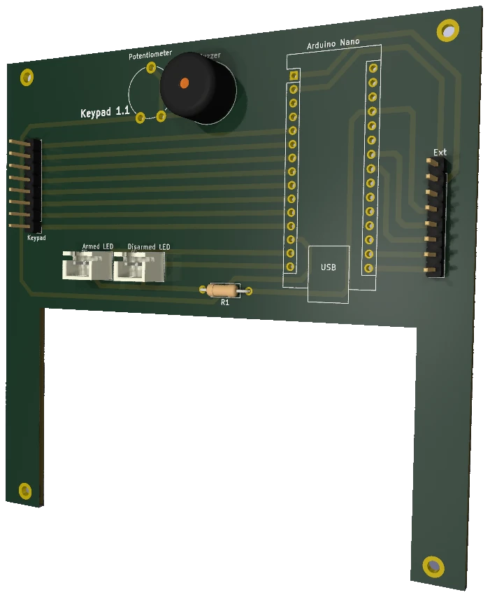
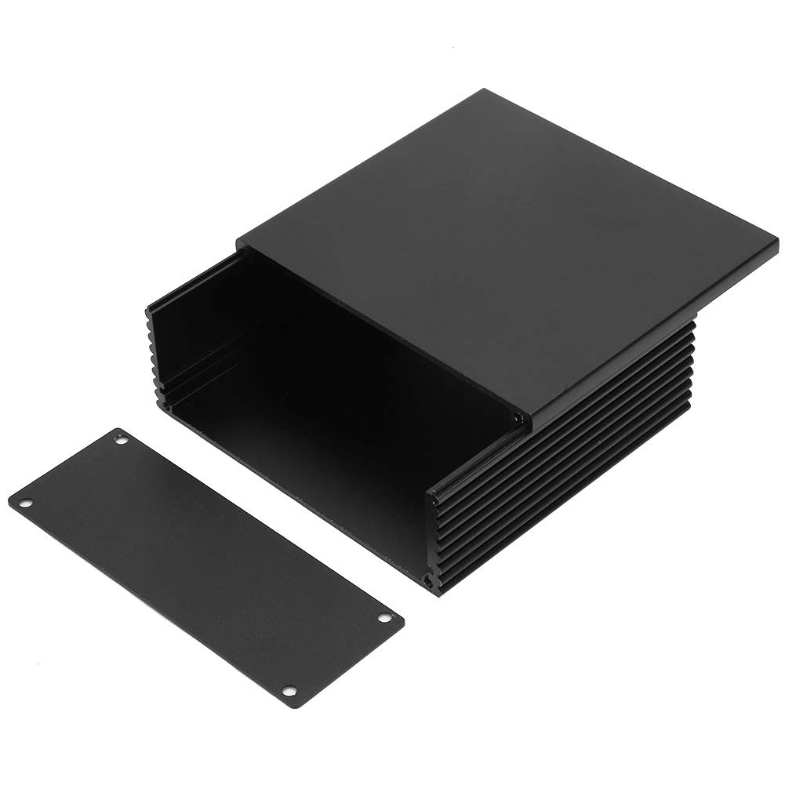
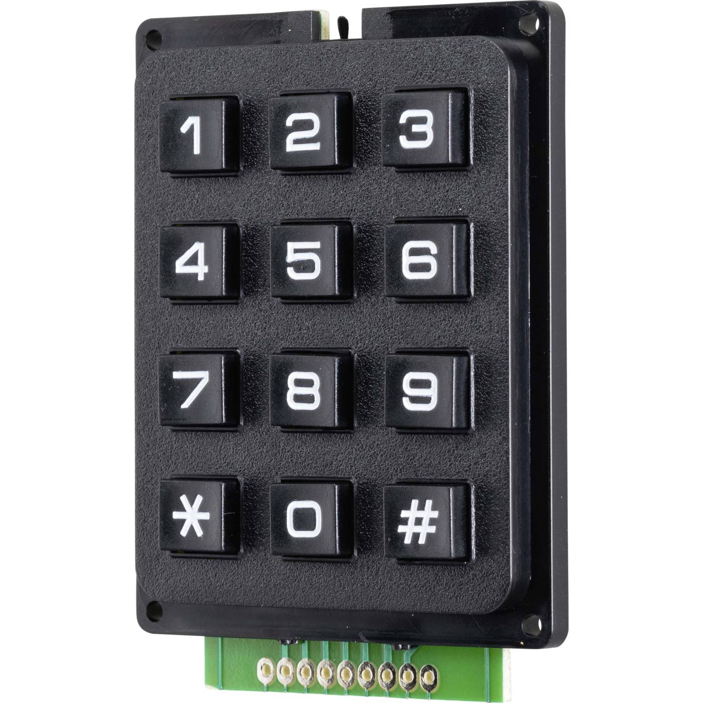
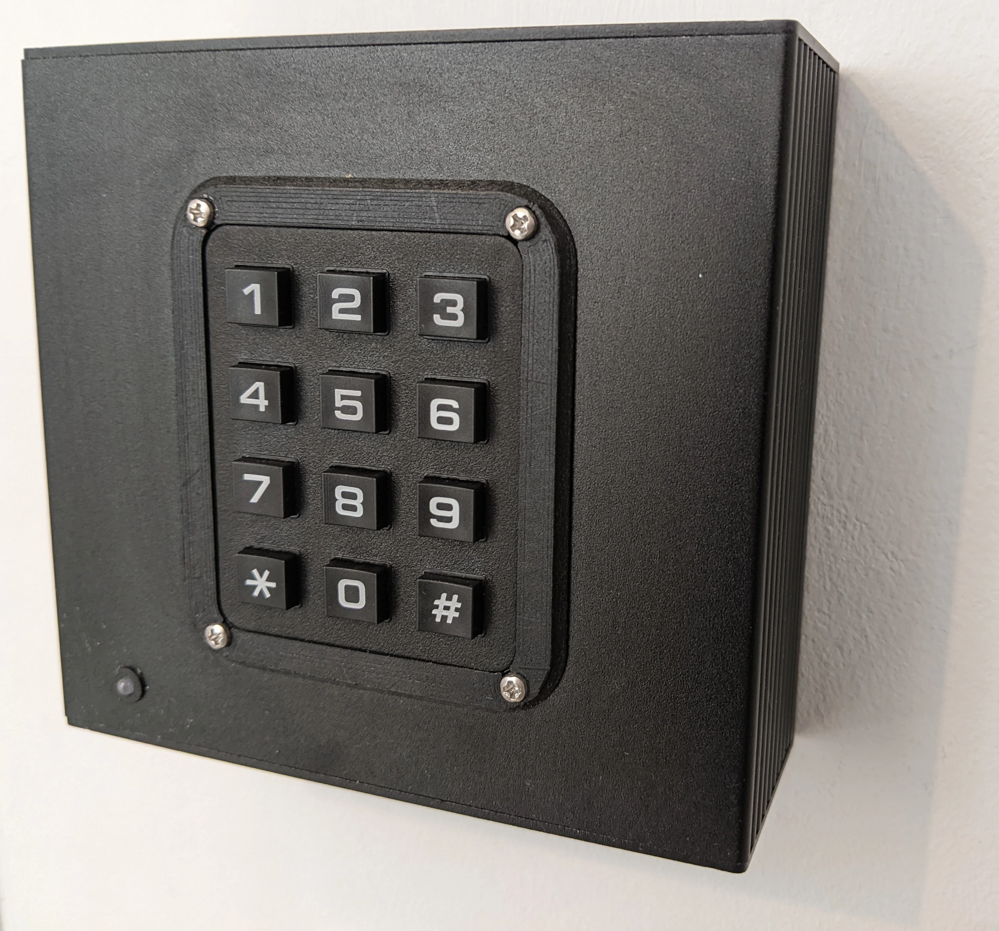

# Alarm keypad PCB

KiCad project for alarm keypad PCB.

You can find a firmware designed to run on this board [on the dedicated repository](https://github.com/alarm-keypad/firmware).

## Required parts

- Resistor for LEDs (value depends on wanted brightness)
- Buzzer (model depends of wanted sound)
- Potentiometer for buzzer (to set sound level)
- Arduino Pro Micro (5V)
- 2x JST connector 1x02 2.50mm pitch (for case mounted LED)
- 2x 2.54mm 8 pins female connectors

## Integration

It is designed to be installed in an aluminium junction box 40x100x110mm.

You can use different kind of keypads, for example:
- Tru Components 4x3, or 4x4 (with A, B, C, D letters),
- Membrane matrix 4x4.

Tru Components 4x3 can be integrated in the case using the following resources.
See [drill and cut file](integration/keypad_drill_cut.pdf) to prepare the case.
Then you can use [this 3D printable border](integration/keypad_border.stl) to
make its integration clean.

## KiCAD project

Arduino Pro Micro KiCAD files can be downloaded
[from this GitHub repository](https://github.com/g200kg/kicad-lib-arduino).

Piher PT-10 potentiometer 3D model can be downloaded
[from grabcad](https://grabcad.com/library/piher-pt-10-1).
Its scale has to be divided by 10.
